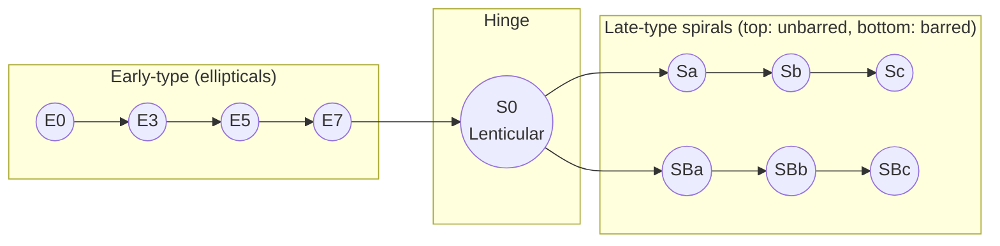

# 04 — The Hubble Tuning Fork

> Before our CNN can learn anything about galaxies, we should understand the categories it's being asked to predict. Those categories come from a 1926 diagram by **Edwin Hubble** that still anchors extragalactic astronomy a century later.

---

## A Brief History

In the early 20th century, astronomers weren't even sure whether the fuzzy "nebulae" in the night sky were inside our Milky Way or far beyond it. **Edwin Hubble** settled the question in 1923–1924 by measuring distances to Cepheid variable stars in the Andromeda Nebula (M31), showing it lay millions of light-years away. Andromeda was a *separate galaxy*. The "Realm of the Nebulae" — Hubble's later book — was suddenly a realm of *galaxies*, an entire universe of them.

Having established that galaxies exist as discrete island universes, Hubble immediately faced a follow-up problem: **they don't all look the same.** Some are smooth elliptical blobs of light; others are flat, photogenic disks with sweeping arms. To make sense of this zoo, in **1926** he proposed a classification scheme, refined in his 1936 book *The Realm of the Nebulae*. The resulting **tuning fork diagram** is the foundational morphology scheme we still teach today.

> Why does this matter for our ML project? Because every label in the Galaxy Zoo dataset descends from this scheme. The "spiral", "elliptical", and "merger" classes our CNN will predict are the modern continuation of Hubble's 1926 categories.

---

## The Diagram



The shape gives the diagram its name: the *handle* on the left holds the ellipticals; the *prongs* on the right hold the two families of spirals (unbarred on top, barred on bottom); the *S0* type sits at the fork, bridging them.

If GitHub doesn't render mermaid for you, here's the same picture as text:

```
      E0 — E3 — E5 — E7 — S0 ─┬─ Sa ─ Sb ─ Sc      (unbarred spirals)
                              └─ SBa ─ SBb ─ SBc   (barred spirals)
```

A canonical rendered version: [the Hubble sequence on Wikipedia](https://en.wikipedia.org/wiki/Hubble_sequence#/media/File:Hubble_sequence_photo.png) (photo-mosaic) and [the schematic version](https://en.wikipedia.org/wiki/Hubble_sequence#/media/File:Hubble_Tuning_Fork_diagram.svg).

---

## Reading the Labels

### Ellipticals: E0–E7

Ellipticals are classified by **how round or how flattened they appear on the sky**. The number `n` after `E` is:

```
n = 10 * (1 − b/a)
```

where `a` and `b` are the major and minor axes of the visible image.

- **E0** — circular on the sky (could still be a 3D ellipsoid we're seeing along its axis).
- **E7** — highly flattened, almost cigar-like.

A subtle point: this is a *projected* shape. An E0 might be a sphere, *or* a football we happen to be looking down the long axis of. Morphology only tells us so much without other observations.

### Lenticulars: S0

The hinge of the fork. **Lenticulars** have a disk (like a spiral) but no spiral arms (like an elliptical). We'll return to them in Week 3 because they're the most common source of confusion for classifiers — they sit in the visual no-man's-land between the two main families.

### Spirals: Sa, Sb, Sc

Disk galaxies with arms. The lowercase letter encodes two correlated properties:

| | Sa | Sb | Sc |
|---|---|---|---|
| Central bulge | Big | Medium | Small |
| Arm pitch | Tightly wound | Intermediate | Loosely wound, "open" |
| Star formation | Less active | Active | Most active |

The barred sequence `SBa`, `SBb`, `SBc` is identical, except a straight **bar** of stars crosses the centre. Our own **Milky Way** is an `SBbc`-ish galaxy — barred, intermediate arms.

### Irregulars: Irr / Irr I / Irr II

Galaxies that won't sit on the fork: chaotic morphology, often the result of **tidal interactions** or **mergers**, sometimes just intrinsically clumpy dwarfs. We'll meet them in detail in [`05-galaxy-morphologies.md`](05-galaxy-morphologies.md).

Hubble didn't include them on the original tuning fork; later astronomers tacked them on as a separate class.

---

## "Early-Type" vs "Late-Type" — A Famous Misnomer

You will read in many textbooks that ellipticals are **early-type galaxies** and spirals are **late-type galaxies**. Hubble *did* think of the diagram as some kind of evolutionary sequence — ellipticals → spirals — but **modern astrophysics has thoroughly rejected that picture**.

In reality:

- Many ellipticals are *older* and more evolved than spirals.
- Mergers of two spirals can *create* an elliptical.
- Star formation in spirals quenches over time, potentially turning them into S0s and then ellipticals.

So the names "early" and "late" survive only as **historical jargon for left and right on the tuning fork**, not as a real sequence in time. Don't read too much into them.

---

## Why Morphology Matters Astrophysically

Galaxy shape is not just aesthetics; it correlates with the physics inside:

- **Dynamics.** Ellipticals are *pressure-supported* — their stars orbit randomly, like bees around a hive. Spirals are *rotation-supported* — stars and gas orbit coherently in a thin disk.
- **Star formation.** Ellipticals contain little cold gas and form few new stars. Spirals (and especially irregulars) are gas-rich and actively form stars.
- **Stellar populations.** Ellipticals are dominated by old, red, low-mass stars ("red and dead"). Spirals contain a mix of old bulge stars and young blue disk stars.
- **Dark matter.** All galaxies are embedded in dark matter halos, but the way the visible galaxy "settles" inside the halo differs sharply between disks and spheroids.
- **Environment.** Ellipticals dominate the dense cores of galaxy clusters; spirals are more common in the "field". This is a clue to how environment shapes evolution (the **morphology–density relation**).

Classifying a galaxy is therefore a first compressed summary of all the above. It's also enormously easier than measuring spectra or velocities — we just need an image. Which is exactly the problem a CNN is good at.

---

## Modern Refinements

Real astronomy uses extended schemes:

- **de Vaucouleurs system.** Adds intermediate types (SAB for "weakly barred") and ring/lens features. This is the basis of many professional catalogues.
- **Galaxy Zoo (and Galaxy Zoo 2).** Crowdsourced classification of hundreds of thousands of SDSS galaxies into a decision-tree of morphology questions ("Is there a sign of a bar?", "How many spiral arms?"). The **dataset we'll use** is built from these labels.
- **Survey-specific simplifications.** For ML, people commonly collapse the labels to a handful of classes (e.g. {elliptical, spiral, irregular, merger}) to make the problem tractable.

For our CSoT project we'll work with a small number of high-level classes — that's plenty to build a useful CNN without drowning in label noise.

---

## Quick Self-Check

1. What does the `0` in `E0` mean? What about the `7` in `E7`?
2. Which class sits at the *hinge* of the tuning fork?
3. Is the Milky Way an `Sa`, `Sb`, or `Sc`? Barred or unbarred?
4. Is "early-type" actually earlier in time? Why or why not?
5. Why are elliptical galaxies typically redder than spirals?

<details>
<summary>Answers</summary>

1. They encode apparent flattening: `n = 10·(1 − b/a)`. `E0` is round on the sky; `E7` is highly flattened.
2. **S0**, lenticular.
3. An `SBbc`-ish galaxy — barred, intermediate arm winding.
4. No. The terms are historical, from a refuted evolutionary picture. They just label left vs right on the diagram.
5. Because they contain mostly old, low-mass stars and have little cold gas left to form new (blue, hot, short-lived) stars.

</details>

---

## External Resources

- 📘 [Wikipedia — Hubble sequence](https://en.wikipedia.org/wiki/Hubble_sequence). Starts at the right level; the references at the bottom are excellent.
- 📘 [Las Cumbres Observatory — Galaxies](https://lco.global/spacebook/galaxies/) — a friendly cosmology-flavoured tour.
- 📘 [NASA/ESA Hubble — Galaxies](https://hubblesite.org/contents/articles/galaxies) — the namesake telescope's gallery.
- 📘 [Galaxy Zoo project — About](https://www.zooniverse.org/projects/zookeeper/galaxy-zoo/about/research) — the citizen-science effort that labels our dataset.
- 📺 [Crash Course Astronomy — Galaxies (Episode 38)](https://www.youtube.com/watch?v=l7bA5KCNDb4) (~12 min) — Phil Plait does a great whirlwind tour.
- 📺 [Dr. Becky — Galaxy Classification Explained](https://www.youtube.com/watch?v=l85ftq6h5Z4) — short, accurate, and entertaining.
- 📄 [Willett et al. 2013 — Galaxy Zoo 2 catalogue](https://academic.oup.com/mnras/article/435/4/2835/1023755) — the paper behind our dataset.
- 📄 [Buta 2013 — Galaxy Morphology (review article, arXiv)](https://arxiv.org/abs/1304.7771) — when you want the rigorous modern picture.

---

⬅️ Previous: [`03-gpu-acceleration.md`](03-gpu-acceleration.md) | ➡️ Next: [`05-galaxy-morphologies.md`](05-galaxy-morphologies.md)
