# 06 — How Telescopes See: From Photons to Pixels

> Before we can feed galaxy images to a neural network, we should understand where those images *come from*. Every pixel in our dataset is a count of photons that travelled for hundreds of millions of years, fell onto a silicon detector, and got turned into a number. This page is the bridge between the sky and the tensor.

---

## A Telescope Is a Light Bucket

Strip away the romance and a telescope is two things:

1. **A collector** — a big mirror (or lens) that gathers as much light as possible. Bigger mirror → more photons → fainter objects become visible. The Sloan telescope that took our data has a 2.5-metre mirror.
2. **A detector** — a device at the focus that records the light. For the last ~40 years, that detector has almost always been a **CCD**.

Your eye is also a light bucket, but a terrible one for astronomy: its "exposure time" is about 1/15th of a second, it can't accumulate light, and it throws away the data the instant you look away. A CCD fixes all three problems.

---

## The CCD: Digital Film

A **CCD (Charge-Coupled Device)** is a grid of millions of tiny light-sensitive elements — the **pixels** — etched into a slab of silicon. The physics is beautifully simple:

```
photon hits silicon  →  photoelectric effect frees an electron  →  electron trapped in a "well"
```

Each pixel is a microscopic bucket. The longer you expose, the more photons arrive, the more electrons pile up in each well. When the exposure ends, the camera reads out **how many electrons are in each well**, row by row, and that count *is* the pixel value.

So a raw astronomical image is literally a **2D array of electron counts** — which is to say, a matrix, which is to say, a [tensor](02-pytorch-tensors.md). The link to PyTorch is not a metaphor; it's the same object.

### Key properties of a CCD

| Property | What it means | Why it matters for us |
|---|---|---|
| **Linearity** | Output count is proportional to photons received (until the well saturates). | Pixel brightness is a real physical measurement, not an artistic choice. |
| **Quantum efficiency (QE)** | Fraction of incoming photons actually detected (modern CCDs: 80–90%+). | Far better than photographic film (~2%); why CCDs took over. |
| **Dynamic range** | Ratio of the brightest to faintest recordable signal. | A galaxy's bright core and faint outskirts can both be captured. |
| **Read noise & dark current** | Unwanted electrons from electronics and thermal energy. | Real data is noisy; our model must be robust to it. |
| **Saturation / blooming** | A full well overflows into neighbours, causing streaks. | Bright foreground stars sometimes corrupt nearby galaxy pixels. |

> CCDs are monochrome. A pixel well counts electrons; it has no idea what *colour* the photons were. This single fact drives everything in the next page, [`07-photometry-and-filters.md`](07-photometry-and-filters.md).

---

## From Raw Frame to Science Image

The number that lands in our dataset is not the raw electron count. Several **calibration** steps happen first. You don't need to perform these (the survey did), but knowing they exist explains why the images look clean:

1. **Bias subtraction** — remove the baseline electronic offset present even in a zero-second exposure.
2. **Dark subtraction** — remove thermal electrons that accumulate even with the shutter closed.
3. **Flat fielding** — divide by an image of a uniformly lit surface to correct for pixel-to-pixel sensitivity differences and dust shadows.
4. **Cosmic-ray removal** — high-energy particles leave sharp spikes that aren't astronomical; these get cleaned.
5. **Astrometric & photometric calibration** — tie pixel positions to real sky coordinates (RA/Dec) and pixel counts to a real brightness scale (magnitudes).

```mermaid
flowchart LR
    sky["Photons from a galaxy"] --> mirror["2.5m mirror collects light"]
    mirror --> filter["Filter selects a wavelength band"]
    filter --> ccd["CCD: photons to electrons"]
    ccd --> raw["Raw frame (electron counts)"]
    raw --> calib["Calibration<br/>(bias, dark, flat, cosmic-ray)"]
    calib --> sci["Science image<br/>(per-band, calibrated)"]
    sci --> rgb["3 bands combined into an RGB JPG"]
    rgb --> dataset["Galaxy Zoo 2 image in our dataset"]
```



The last two steps — combining bands into colour and packaging as a JPG — are what produce the files in the [Galaxy Zoo 2 Kaggle dataset](https://www.kaggle.com/datasets/jaimetrickz/galaxy-zoo-2-images).

---

## The Sloan Digital Sky Survey (SDSS)

Our images come from the **SDSS**, one of the most productive astronomical projects ever undertaken.

- **Telescope:** a dedicated 2.5-metre telescope at Apache Point Observatory, New Mexico.
- **Camera:** historically a famous **drift-scan camera** with 30 CCDs, imaging the sky in five filters at once as the Earth rotated.
- **Output:** imaging and spectra for **hundreds of millions** of objects across roughly a third of the sky.
- **Impact:** thousands of papers; it essentially created the era of "survey astronomy" and data-driven extragalactic science.

Galaxy Zoo took SDSS galaxy images and crowdsourced their morphological classification — which is why our dataset exists at all. We are, in effect, training a network to replace the very volunteer effort that made the labels.

---

## Why This Matters for the Model

Understanding the imaging chain pays off directly when we build and debug the model:

- **Pixel values are physical.** When we **normalise** pixels in [`08-data-pipelines.md`](08-data-pipelines.md), we're rescaling a real measurement, not arbitrary RGB.
- **Noise is real and structured.** Read noise, sky background, and cosmic rays mean our model must generalise past imperfections. This motivates data augmentation later.
- **Artefacts cause misclassifications.** Saturated stars, satellite trails, and diffraction spikes can fool both humans and CNNs — useful to remember when reading the Week-3 confusion matrix.
- **Resolution is finite.** A distant spiral may be smeared into a featureless blob. The model can only see what the telescope resolved.

---

## Quick Self-Check

1. In one sentence, what physical quantity does a raw CCD pixel value represent?
2. Why can't a single CCD exposure record colour?
3. Name two calibration steps and what each removes.
4. Why does a bigger telescope mirror let us see fainter galaxies?

<details>
<summary>Answers</summary>

1. The number of electrons collected in that pixel's well, which is proportional to the number of photons that struck it during the exposure.
2. A CCD well only counts electrons; it has no wavelength information. Colour requires taking separate exposures through different filters.
3. Any two of: bias (electronic offset), dark (thermal electrons), flat field (per-pixel sensitivity + dust), cosmic-ray removal (particle hits).
4. A larger mirror collects more photons per unit time, so faint sources accumulate enough signal to rise above the noise.

</details>

---

## External Resources

- 📘 [SDSS — About the survey](https://www.sdss.org/) and [SDSS instruments / camera](https://www.sdss.org/instruments/).
- 📘 [How CCDs work — Stanford SLAC explainer](https://www6.slac.stanford.edu/) (search "CCD"), or [Wikipedia — Charge-coupled device](https://en.wikipedia.org/wiki/Charge-coupled_device).
- 📘 [ESA/Hubble — How astronomical images are made](https://esahubble.org/about/general/credits/) and [behind-the-scenes "How to make a Hubble image"](https://esahubble.org/projects/fits_liberator/improc/).
- 📺 [Las Cumbres Observatory — How telescopes and CCDs work](https://lco.global/spacebook/telescopes/).
- 📺 [Crash Course Astronomy — Telescopes](https://www.youtube.com/watch?v=3HmF1JFFi-c).
- 📄 [Gunn et al. 1998 — The SDSS Photometric Camera (arXiv)](https://arxiv.org/abs/astro-ph/9809085) — the actual instrument paper, for the curious.

---

⬅️ Previous: [`05-galaxy-morphologies.md`](05-galaxy-morphologies.md) | ➡️ Next: [`07-photometry-and-filters.md`](07-photometry-and-filters.md)
